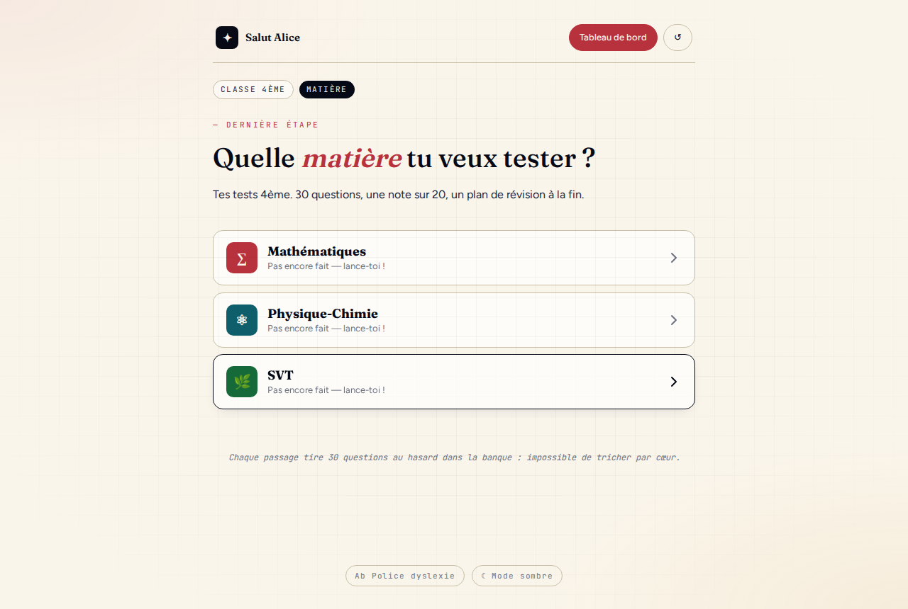
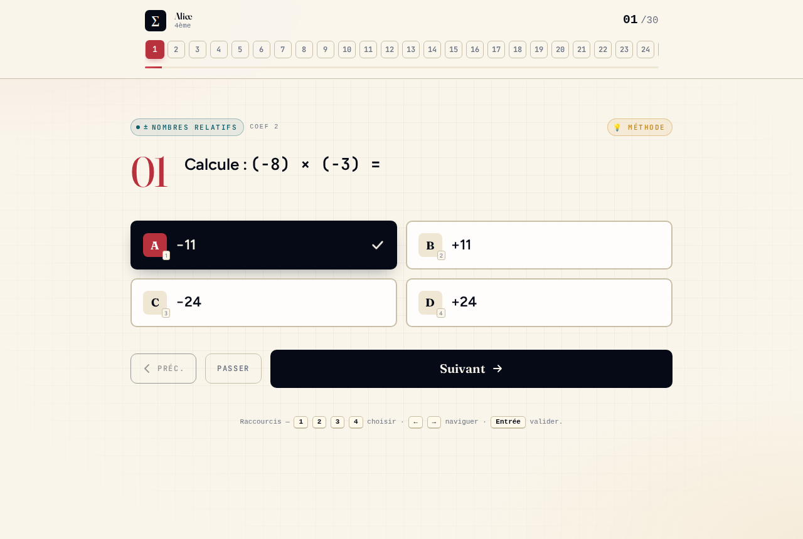
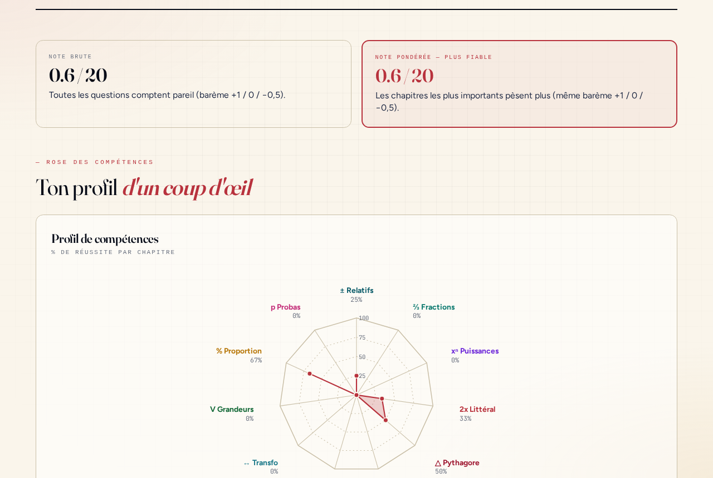
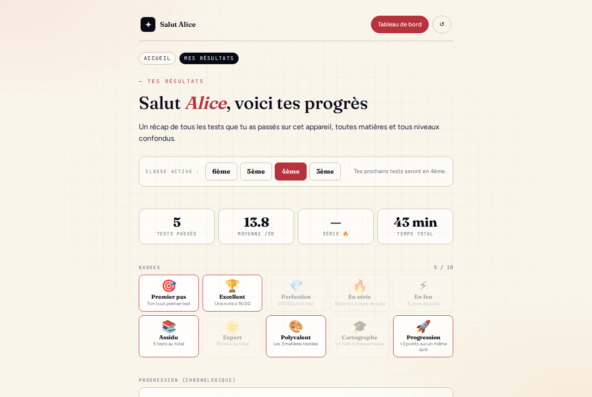

# Quizz Collège

Plateforme d'évaluations diagnostiques pour collégiens : **12 quiz** (6ème → 3ème × maths / physique-chimie / SVT), rapport détaillé par chapitre, plan de révision ciblé, PWA installable.

**Démo en ligne** : [web-developpeur.com/quizz](https://web-developpeur.com/quizz)


---

## Ce que ça fait

- **Wizard d'onboarding** — prénom → niveau → matière → quiz → rapport.
- **30 questions tirées aléatoirement** dans une banque par quiz, ordre des réponses mélangé. Impossible de tricher par cœur.
- **Deux modes** : *Entraînement* (ampoule à 3 niveaux, méthode + astuce) et *Interrogation* (sans aide, timer 30 min en 3ème).
- **Barème style brevet** : +1 pt correct · 0 pt passé · **−0,5 pt faux** → incite à passer plutôt qu'à deviner.
- **Rapport final** : rose des compétences (radar SVG), diagnostic par chapitre (acquis/fragile/non-acquis), plan de révision personnalisé, relecture exacte de chaque attempt.
- **Dashboard multi-élèves** : stats cumulées, 10 badges (série, polyvalence, progression…), courbe chronologique, recommandation du prochain test à passer.
- **Persistance bicouche** : `localStorage` (source de vérité offline) + `save.php` / `load.php` pour sync cross-device par slug élève.
- **PWA installable**, **mode sombre**, **police dyslexie**, mobile-first.

## Aperçu

<p align="center">
  
  
</p>
<p align="center">
  
  
</p>

<sub>Screenshots régénérables via <code>cd docs && npx playwright test screenshots.spec.js --config=playwright.config.js</code> (serveur lancé sur :8765).</sub>

## Stack technique

| Domaine       | Choix                                                                          |
|---------------|--------------------------------------------------------------------------------|
| Front         | React 18 (UMD) + **TypeScript** compilé au runtime par Babel Standalone (TSX)  |
| Types         | Types de domaine globaux dans `types.ts` · `tsc --noEmit` en CI                |
| Styles        | Tailwind CDN + CSS custom (design tokens maison)                               |
| Routeur       | Hash sémantique maison, compatible `file://`                                   |
| PWA           | Service Worker cache-first, manifest.webmanifest                               |
| Persistance   | `localStorage` + PHP plat (JSON par slug)                                      |
| Build         | `build.sh` (bash + python) : inline CSS + app.tsx + 12 quizzes .tsx            |
| Tests         | Playwright (Chromium) — 48 scénarios E2E · CI GitHub Actions                   |

## Contraintes techniques volontaires (et pourquoi)

Ce projet tourne **sans serveur ni build step au déploiement** et **par double-clic sur `index.html`**. Ce n'est pas de la paresse, ce sont des contraintes assumées :

- **Zero infra** : `scp` le dossier sur un hébergement mutualisé PHP basique, c'est en ligne. Pas de CI deploy, pas de Vercel, pas de Node sur le serveur.
- **File:// compatible** : le parent peut donner l'archive à un enfant qui n'a pas le wifi, il ouvre `index.html` et ça marche offline. Contrainte réelle pour l'usage familial visé.
- **Édition de questions sans rebuild** : les 12 pools de questions (`quizzes/*.tsx`) s'éditent direct, `./build.sh` inline le tout. Un parent non-dev peut corriger une coquille.

Conséquences assumées :
- Babel Standalone charge ~400 KB au premier load (+ preset-typescript inclus dans la bundle UMD depuis 7.10). Acceptable vu le public (jamais plus d'un ou deux cold loads par utilisateur, le SW cache ensuite).
- **TypeScript strict-progressif** : `tsc --noEmit` en CI attrape les bugs de typage, `types.ts` documente les contrats de données ; `strict: false` le temps de la migration legacy, resserré par étapes.
- Pas de bundler : index.html fait 300 KB inlinés, tout se cache trivialement côté SW.

## Architecture

SPA mono-HTML. Un seul `index.html` déployé, construit par `build.sh` à partir de :

```
index.html           template (wizard vanilla JS + markers BEGIN_QUIZZES / BEGIN_APP_JSX)
app.tsx              logique React partagée (HomeScreen, QuizScreen, ReportScreen…)
app.css              styles du quiz React (wizard-style inline dans index.html)
types.ts             types de domaine globaux (QuizConfig, Attempt, AnalyzeResult, props React…)
quizzes/             12 fichiers TSX, un par quiz (window.ALL_QUIZZES['maths-5'] = {...})
build.sh             concat tout → index.html, bump CACHE_NAME dans sw.js
tsconfig.json        strict-progressif, cible TSX via preset-typescript
```

### Routeur hash sémantique

`location.hash` plutôt que `history.pushState` (interdit sur file:// — SecurityError).

| Route                              | Effet                                           |
|------------------------------------|-------------------------------------------------|
| `#/prenom`, `#/niveau`             | Étapes wizard                                   |
| `#/{N}eme` (N ∈ 3..6)              | Sélection matière pour la classe N              |
| `#/{N}eme/{maths\|physique\|svt}`  | Monte le quiz React pour `{subject}-{N}`        |
| `#/{N}eme/{subject}/report/<ISO>`  | Deep-link vers un rapport archivé (relecture)   |
| `#/dashboard`                      | Tableau de bord cross-matière                   |

### Scope isolation vanilla ↔ React

Le routeur vanilla d'`index.html` et `app.tsx` partagent la même page. Pour éviter les collisions de noms globaux (`ALL_BADGES`, `slugName`, `showToast`…), **`app.tsx` est wrappé dans une IIFE**. Communication via `window` :

- `window.mountQuizApp(key, {reportAt})` / `window.unmountQuizApp()` exposés par `app.tsx`
- `window.setHashSilently(hash)` exposé par le routeur
- `window.__pendingQuizMount` : queue pour gérer la race condition entre le routeur (synchrone au load) et Babel (async)

### Swap dynamique de configuration

Passer d'un quiz à l'autre sans recharger la page : les constantes `CFG / SUBJECT / DOMAINS / POOL / PICK / PLANS` sont des `let` module-level, réassignées par `setActiveQuiz(key)` avant chaque `quizRoot.render(<App key={key} />)`. La React-key force un remount complet, les fonctions capturent par closure les valeurs actuelles.

## Démarrer en local

```bash
# Prérequis : Python 3 + Node 20 + npm
npm install
npx playwright install chromium --with-deps

# Build (inline quizzes/*.tsx + app.tsx + app.css dans index.html)
./build.sh

# Validation d'intégrité des pools
npm run validate

# Type-check (mêmes règles que le CI)
npm run typecheck

# Serve + tester
npm run serve &
npm test
```

Pour lancer sans serveur : **double-clic sur `index.html`** après `./build.sh`. Le service worker et la sync serveur se désactivent automatiquement en `file://`.

## Ajouter / modifier un quiz

Les questions sont dans `quizzes/{matière}-{niveau}.tsx`, une par ligne environ. Chaque pool contient :

```js
window.ALL_QUIZZES['maths-4'] = {
  SUBJECT: { id:'maths-4', name:'Mathématiques', level:'Fin de 4ème', ... },
  DOMAINS: { relatifs: { name:'Nombres relatifs', coef:2, ... }, ... },
  POOL: {
    relatifs: [
      { key:'rel-1', q:<>Calcule <M>−3 + 7 =</M></>, options:['4','−10','10','−4'], correct:0, hint:'...' },
      ...
    ],
  },
  PICK: { relatifs: 4, ... },   // somme = 30 (vérifié par validate.js)
  PLANS: { relatifs: { 'non-acquis': [...], 'fragile': [...] } },
};
```

Après édition : `./build.sh`. `npm run validate` détecte les clés dupliquées, `PICK ≠ 30`, `correct` hors plage, doublons numériques dans les options.

## Tests

```bash
npm test                 # 48 scénarios, ~2 min, headless Chromium
npm run test:headed      # visible (debug)
```

Couverture :
- **Landing / wizard** : prénom → niveau → matière, mémoire cross-visite, changement d'élève
- **Quiz** : modes entraînement/interro, 4 options, clic/clavier/nav précédent-suivant, timer 3ème, ampoule 3 niveaux
- **Rapport** : note sur 20, diagnostic par chapitre, rose des compétences, relecture via deep-link
- **Dashboard** : badges, historique, recommandation, retour wizard
- **SPA routing** : URL `#/...` à chaque étape, deep-link quiz, hash invalide → flow normal, transition quiz A → wizard → quiz B
- **Design / a11y** : tap targets ≥ 44px sur mobile, mode sombre, police dyslexie, absence d'erreurs console bloquantes
- **PWA** : manifest servi, SW accessible, icon.svg

## Déploiement

```bash
./build.sh
# Upload index.html + sw.js + manifest.webmanifest + icon.svg + save.php + load.php
# Protéger data/ côté hébergeur (ex: .htaccess Deny) — save.php y écrit les JSON élèves.
```

C'est tout : pas de process node, pas de rewrite rules, pas de base de données.

## Licence

[MIT](LICENSE)
